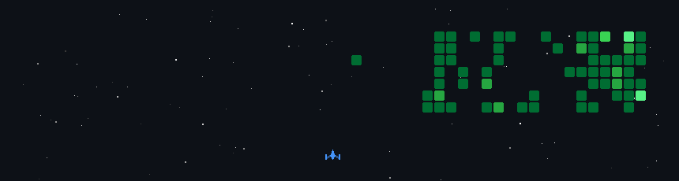
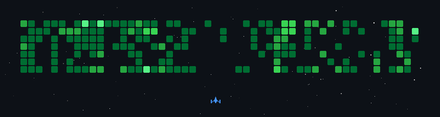

# Hi, I'm Abdully 👋

**Software Developer — Backend & AI Systems | Electronics Enthusiast (RF & Circuit Design)**

I build backend systems and offline AI tools, and design transistor-level RF circuits on the side. Most profiles pick one lane — I work both, and that combination is the throughline of what's below.

--- 

## 🛠 Tech Stack

**Backend & APIs**

**AI / ML**
- RAG pipelines (retrieval-augmented generation)
- ChromaDB vector stores, `sentence-transformers` embeddings (`all-MiniLM-L6-v2`)
- LLM integration — Gemma, Ollama

**Infra**
- Nginx + Gunicorn/Uvicorn workers, PgBouncer connection pooling
- JWT-based auth (admin/user roles), `pydantic-settings`, `asyncpg`
- Git/GitHub workflows — branch protection, PR review, conventional commits

**Electronics**
- RF transmitter circuit design (AM/FM, multi-stage ~98 MHz builds)
- Transistor amplifier analysis (2N2222, BC547 — common-emitter, bias networks)
- Proteus simulation & troubleshooting

---

## 📌 Featured Projects

### 🔹 TOALM V2 — Offline Artificial Teacher AI
Offline AI model that tracks a student's strengths/weaknesses against the Tanzania syllabus and recommends lessons or exercises accordingly.
`FastAPI` `SQLite` `Gemma` `RAG` `BKT-based adaptive mastery engine`

### 🔹 Offline RAG Chatbot — Ai-CHATBOT--01
PDF-trained Q&A assistant. Ingests documents, embeds and retrieves via ChromaDB, and answers fully offline — no external API calls.
`FastAPI` `React` `ChromaDB` `Gemma / Ollama` `sentence-transformers`

### 🔹 OAL-PROJECT--02 — Backend System
FastAPI + PostgreSQL backend built module-by-module (config, security, database, dependencies), designed for a load-balanced deployment (Nginx + Gunicorn/Uvicorn + PgBouncer).
`FastAPI` `PostgreSQL` `asyncpg` `JWT`

> Replace or add repo links once you decide which ones go public — see note below.

---

## 🔭 Currently

Building out the embeddings / vector-indexing module for the offline RAG chatbot — batch embedding and ChromaDB storage via `scripts/build_index.py`.

---

## Contribution game

---
## 📫 Connect

- GitHub: [Abdully-dev](https://github.com/Abdully-dev)
- Email: (seniorkalima194@gmail.com)
- WhatsApp: [Chat on WhatsApp](https://wa.me/255706075287)
- LinkedIn: [Abdulsalam Kalima](https://www.linkedin.com/in/abdulsalam-kalima-45a75a429/)

